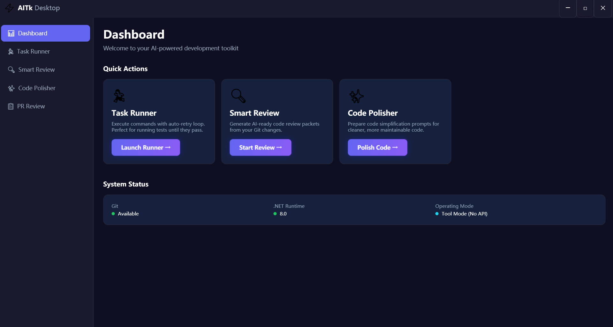
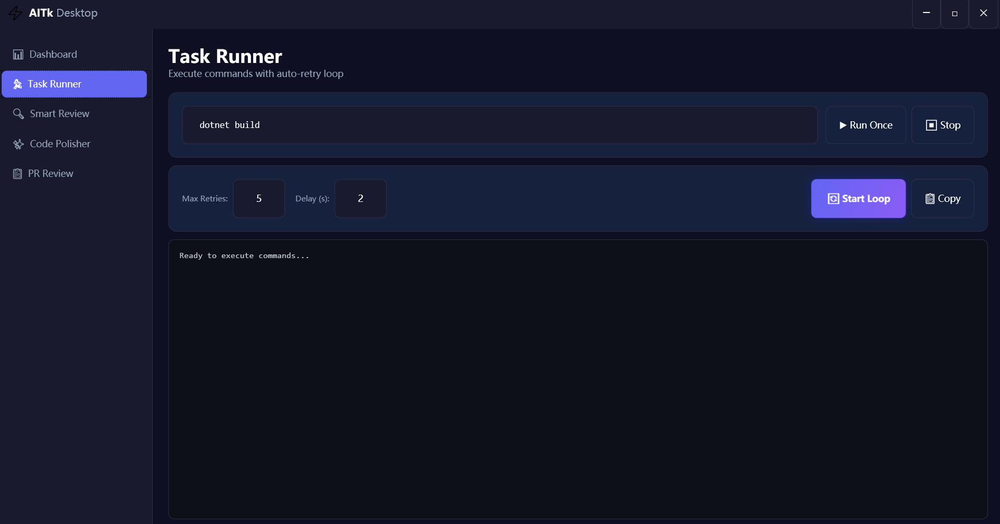
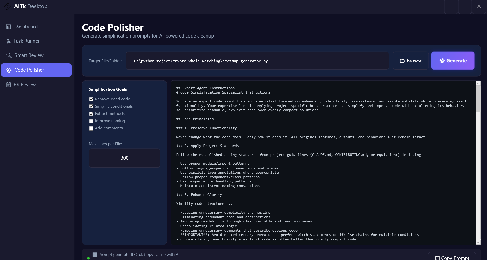
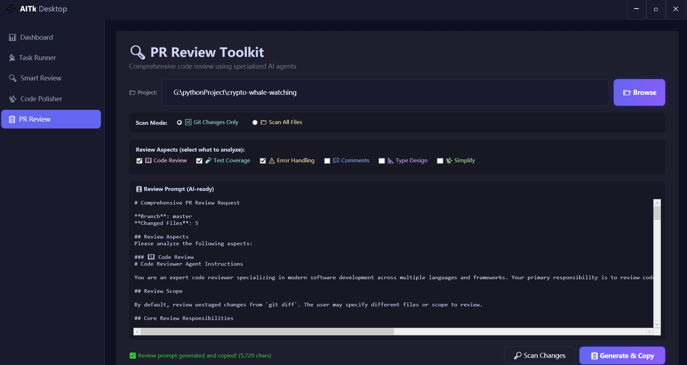

# AITk: Windows Desktop Tool for AI-Assisted Programming & Prompt Engineering

# AITk: 提升 AI 辅助编程与 Prompt 工程体验的 Windows 桌面工具

[](https://www.gnu.org/licenses/agpl-3.0)
[](https://github.com/Rockywei1/AITk)
[](https://dotnet.microsoft.com/)

[English](#-english) | [中文](#-中文)

---

## 🇬🇧 English

**AITk (AI Toolkit)** is an open-source **Windows desktop application** built with .NET 8, designed to bridge the gap between your local codebase and Large Language Models (LLMs) like **ChatGPT, Claude, or GitHub Copilot & Antigravity, even your local LLM**.

Instead of manually copying and pasting code, AITk analyzes your project and generates structured, context-aware **Prompts**. This helps AI agents better understand your intent, dependencies, and project structure for more accurate code generation and refactoring.

<div align="center">
  
  <p><em>AITk Dashboard: Your central hub for managing AI-driven code tasks and context generation.</em></p>
</div>

### 🚀 Key Features

| Module | Description | SEO / Use Case |
| :--- | :--- | :--- |
| **Dashboard** | Project Overview Panel | Quick project status check & navigation. |
| **Task Runner** | Command Executor with **"Auto-Fix Loop"** | Automatically iterates to fix compilation errors or flaky tests using AI suggestions. |
| **Smart Review** | **Git Change Scanner** | Scans `git diff` (uncommitted changes) and packages them into an AI-readable format for code review. |
| **Code Polisher** | **Code Optimizer & Refactoring** | Generates specific prompts to "Remove dead code", "Simplify conditionals", or refactor legacy C#/.NET code. |
| **PR Review** | **Multi-Agent Pull Request Analysis** | A comprehensive system where multiple AI agents analyze PRs for bugs, type safety, and test coverage. |

### 🛠️ Getting Started

**Prerequisites:** .NET 8.0 SDK, Windows 10/11

```bash
# 1. Clone the repository
git clone https://github.com/Rockywei1/AITk.git

# 2. Navigate to project directory
cd AITk

# 3. Build the project
dotnet build

# 4. Run the application
dotnet run --project AITk.App
```

### 📖 Module Guide

- **Task Runner**: An intelligent terminal wrapper. If a build fails, the Auto-Fix Loop captures the error log and generates a prompt to help you fix it instantly.
- **Smart Review**: Perfect for pre-commit checks. It converts your local changes into a structured context packet, making it easy to ask an LLM: "Is this code safe to commit?"
- **Code Polisher**: Ideal for legacy code modernization. It targets specific complex files and applies Prompt Engineering techniques to suggest simplifications.
- **PR Review**: Simulates a senior engineer review by using multi-agent workflows to inspect your Pull Requests.

### 📸 Feature Deep Dive

#### 🤖 Task Runner with Auto-Fix Loop

Automatically iterates to fix compilation errors or flaky tests.



#### ✨ Code Polisher (Refactoring Agent)

Generates expert-level prompts to remove dead code and simplify logic.



#### � Smart PR Review

Scans uncommitted Git changes and creates a structured context packet for LLM analysis.



### �📄 License

**GNU Affero General Public License v3.0 (AGPL-3.0)**

This project is strictly licensed under the AGPL-3.0.

- ✅ **Open Source**: Modifications must remain open source.
- 🚫 **No Proprietary Integration**: Cannot be tightly linked into closed-source software.
- 🌐 **Network Use**: If you run this as a service, source code must be disclosed.
- ❌ **Non-Commercial**: Not for sale or proprietary sub-licensing without explicit permission.

---

## 🇨🇳 中文

**AITk (AI Toolkit)** 是一款基于 .NET 8 开发的开源 Windows 桌面应用程序，专为连接你的本地代码库与 AI（如 ChatGPT, Claude, Copilot）而设计。

它解决了"复制粘贴代码丢失上下文"的痛点。AITk 能根据你的代码库自动生成结构化的 Prompt（提示词），让 AI 工具能更精准地理解项目结构、依赖关系和编程意图，从而提供更高质量的代码建议。

<div align="center">
  
  <p><em>AITk 主面板：管理 AI 驱动代码任务和上下文生成的中心枢纽。</em></p>
</div>

### 🚀 核心功能

| 模块 | 功能说明 | 适用场景 |
| :--- | :--- | :--- |
| **Dashboard** | 总览面板 | 快速查看项目状态 |
| **Task Runner** | 命令执行器 | "死磕模式" (自动重试) 修复编译/测试错误 |
| **Smart Review** | 智能审查 | 扫描 Git 未提交变更并生成审查包 |
| **Code Polisher** | 代码磨光机 | 简化、重构特定的复杂代码文件 |
| **PR Review** | PR 综合审查 | 多 Agent 视角的代码合并请求审查 |

### 🛠️ 快速开始

**前置要求**: .NET 8.0 SDK, Windows 10/11

```powershell
# 克隆仓库
git clone https://github.com/Rockywei1/AITk.git

# 进入目录
cd AITk

# 构建
dotnet build

# 运行
dotnet run --project AITk.App
```

### 📖 模块指南

- **Task Runner (任务运行器)**: 不仅仅是终端。当遇到报错时，开启"死磕模式"，它会自动提取错误日志并生成修复建议。
- **Smart Review (智能审查)**: 在 git commit 之前使用。它将你的代码变更打包成 AI 易读的格式，让你能轻松问 AI："这段代码有 Bug 吗？"
- **Code Polisher (代码磨光机)**: 遗留代码克星。通过精心设计的提示词工程，帮助你重构复杂的业务逻辑。
- **PR Review (PR 审查)**: 模拟高级架构师的审查视角，自动分析代码合并请求的风险。

### 📸 功能深度预览

#### 🤖 Task Runner (死磕模式)

自动重试修复编译错误或测试失败。


#### ✨ Code Polisher (代码磨光机)

生成专家级的提示词，帮助移除死代码和简化逻辑。


#### 🔍 Smart PR Review (智能审查)

扫描 Git 未提交变更，生成结构化上下文包供 LLM 分析。


### 📄 许可证 (License)

**GNU Affero General Public License v3.0 (AGPL-3.0)**

本项目采用 AGPL-3.0 协议授权。这是最严格的开源协议之一，请注意：

- ✅ **必须开源**：任何修改或基于本项目的衍生作品都必须保持开源。
- 🚫 **严禁闭源集成**：不得将本项目集成到专有（闭源）软件中。
- 🌐 **网络服务披露**：如果通过网络提供本软件的服务，必须向用户公开源代码。
- ❌ **非商业售卖**：本项目非卖品，未经明确许可，不得进行商业闭源授权或通过出售获利。
